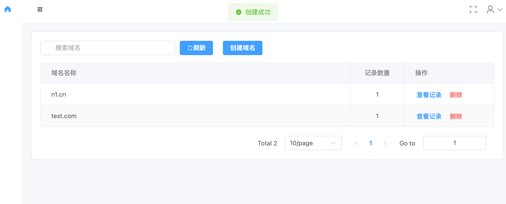

# dnsm

## 项目介绍
基于go开发的dnsm域名解析管理程序，主要用于内网快速实现域名范解析等功能。
- 支持域名的添加、删除、修改、查询
- 支持解析记录的添加、删除、修改、查询
- 通过配置文件多个上游dns服务器配置
- 已嵌入前端，可直接构建也可以独立构建
- 使用jwt认证，默认用户名密码为admin/admin123
- 轻量，使用viper管理配置文件
- 支持热加载配置文件

｜技术栈：
- 后端：go、gin、gorm、viper、miekg/dns
- 前端：vue3 +Typescript + element-plus
前端项目地址：https://github.com/hqiaozhi/dnsm-web


## 快速开始
```bash
# 运行
git clone https://github.com/hqiaozhi/dnsm.git
cd dnsm
go run main.go
```
- 程序会自动查找当前目录下config.yaml文件
- 其次查找目录/etc/dnsm/config.yaml文件

启动后其它设备的dns指向这台设备的ip即可使用内网自定义的域名解析服务。


## 配置示例

```yaml
domains:
    - name: test.com
      records:
        - name: aaa.test.com
          type: A
          value: 192.168.1.1
          ttl: 300
        - name: '*.test.com'
          type: A
          value: 192.168.1.1
          ttl: 300
gin:
    host: 0.0.0.0
    idle_timeout: 15s
    max_multipart_memory: 10485760
    mode: debug
    port: 8080
    read_timeout: 5s
    write_timeout: 10s
jwt:
    audience: api-users
    expire_hours: 2
    issuer: dnsm
    refresh_hours: 24
    secret_key: default-secret-key-32bytes-long-1234
    signing_method: HS256
login:
    password: admin123
    username: admin
server:
    host: 0.0.0.0
    port: 53
upstream:
    - 223.5.5.5:53
```


## 界面展示

更多界面请查看前端项目地址：https://github.com/hqiaozhi/dnsm-web